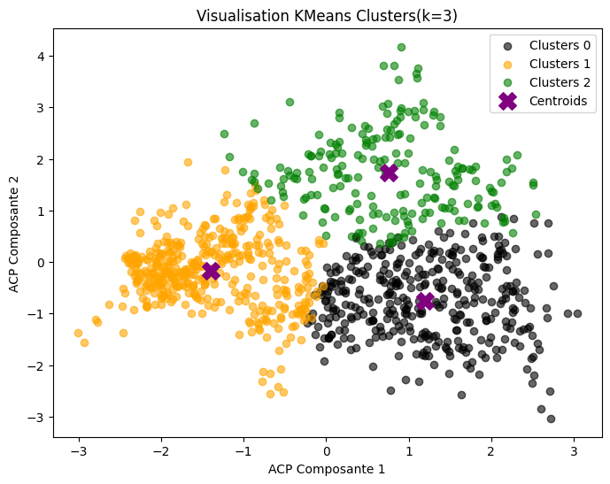
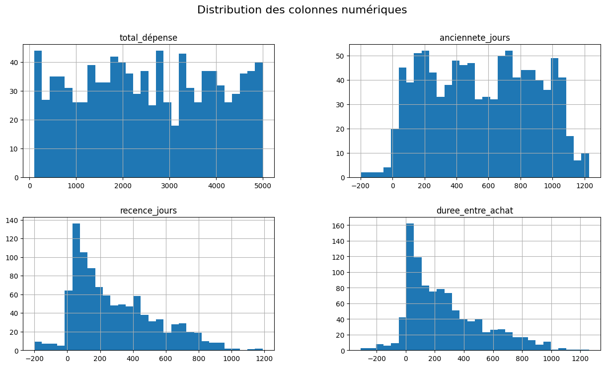
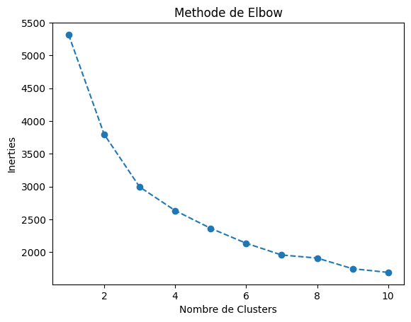
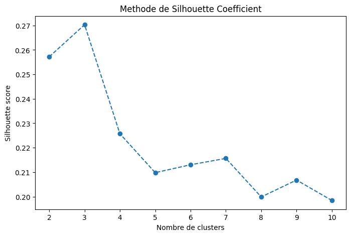

# **Segmentation des Clients avec KMeans**
🚀 **Analyse et segmentation des clients basée sur leurs comportements d'achat**  

## **🔍 Objectif du Projet**
Ce projet vise à **segmenter les clients** en fonction de leurs habitudes d'achat, leur ancienneté et leur récence. Grâce à **KMeans**, nous avons identifié **3 groupes** distincts qui permettent une meilleure compréhension et personnalisation des stratégies marketing.

---



## **📂 Structure du Projet**
```
├── data/                 
│   ├── clients.csv        
│   ├── NewDataClient.csv  
├── notebook/               
│   ├── preprocessing.ipynb     
│   ├── clustering.py      
│   ├── exploration.py   
├── static/              
│   ├── elbow.png   
│   ├── silhouette_coefficient.png 
│   ├── cluster.png
├── .gitignore
├── reqirements.txt       
└── README.md              
```

---

## **🛠 Technologies Utilisées**
- **Pandas** : Manipulation des données  
- **Scikit-learn** : Modélisation avec KMeans  
- **Matplotlib / Seaborn** : Visualisation des résultats  


---

## **📊 Méthodologie**
1️⃣ **Prétraitement des données**
   - Nettoyage et formatage des dates  
   - Extraction des variables clés : `total_dépense`, `ancienneté_jours`, `recence_jours`, `duree_entre_achat`  

2️⃣ **Choix du nombre optimal de clusters**
   - **Méthode du coude** pour analyser la diminution de l'inertie  
   - **Coefficient de silhouette** pour évaluer la cohérence des segments  



3️⃣ **Interprétation des clusters**
   - **Cluster 0** : Clients anciens mais inactifs  
   - **Cluster 1** : Clients récents et engagés  
   - **Cluster 2** : Clients VIP mais achats irréguliers  

---

## **📌 Résultats & Insights**
- **3 segments bien définis** permettent d'optimiser les stratégies marketing.  
- Les **clients récents (Cluster 1) sont les plus actifs**, nécessitant un effort de fidélisation.  
- Les **clients anciens (Cluster 0) doivent être réactivés** via des campagnes ciblées.  
- Les **clients premium (Cluster 2) achètent rarement mais dépensent beaucoup**, ce qui nécessite des offres adaptées.  


---

💡 **Auteur** : Projet ADABI Challenge 
📧 **Contact** : Ruth
📌 **Licence** : MIT / Open Source  


